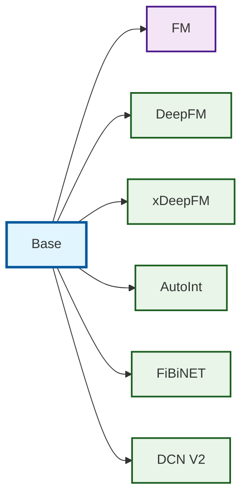

# Factorization Machine (FM) Models

This directory contains implementations of various Factorization Machine models and their extensions.

## Class Inheritance Structure

## Base Class Features

The `Base` class provides common functionality for all FM models:

### Core Components
- **Categorical Features**: Vectorized embedding approach with offset mapping
- **Numerical Features**: Linear weights and batch normalization
- **First-order Interactions**: Efficient computation of Σwᵢxᵢ terms
- **Embedding Management**: Unified embedding setup for second-order interactions

### Key Methods
- `_first_order_interactions()`: Computes linear terms for both categorical and numerical features
- `_setup_categorical_features()`: Creates vectorized embedding tables with offset mapping
- `_setup_numerical_features()`: Initializes linear weights for numerical inputs
- `_get_all_embeddings()`: Retrieves embeddings for higher-order interaction models
- `_get_all_x_values()`: Collects feature values for interaction computations

### Initialization
- Xavier uniform initialization for weights
- Zero initialization for bias terms
- Proper device and dtype handling

## Model Variants

Each model extends the Base class with specific architectures:

- **FM**: Classic Factorization Machine with second-order interactions
- **DeepFM**: Combines FM with deep neural networks
- **xDeepFM**: Enhanced DeepFM with Compressed Interaction Network (CIN)
- **AutoInt**: Attention-based feature interactions
- **FiBiNET**: Bilinear feature interactions with attention
- **DCN V2**: Deep & Cross Network version 2

## Usage

All models inherit the common interface from Base and can handle:
- Mixed categorical and numerical features
- Batch normalization for numerical inputs
- Vectorized operations for efficiency
- Flexible embedding dimensions
